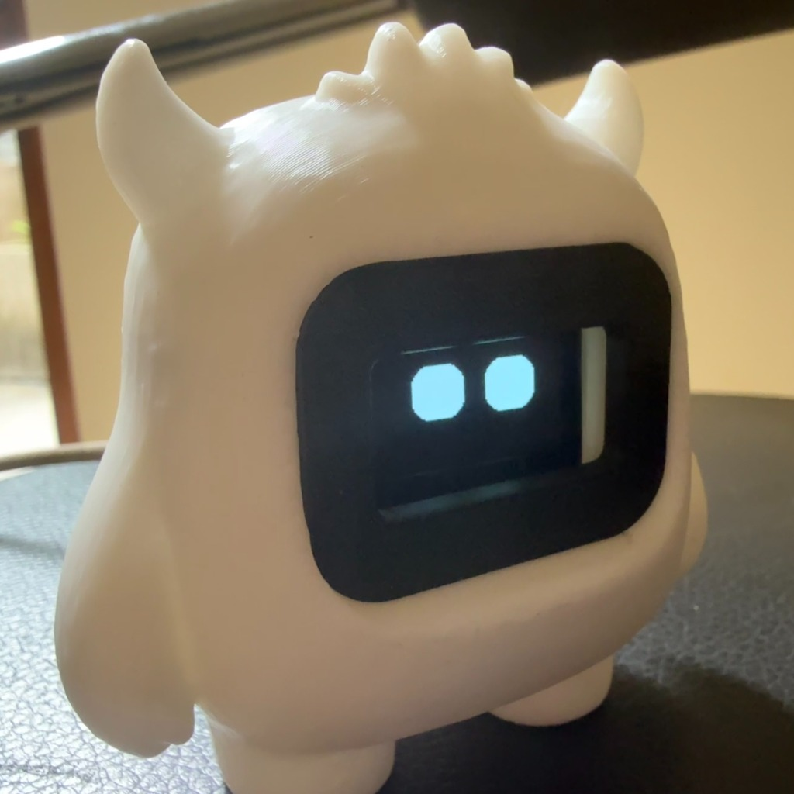
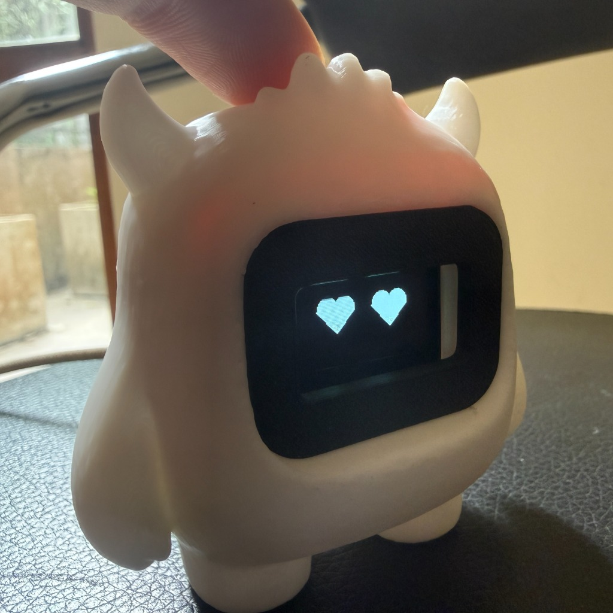
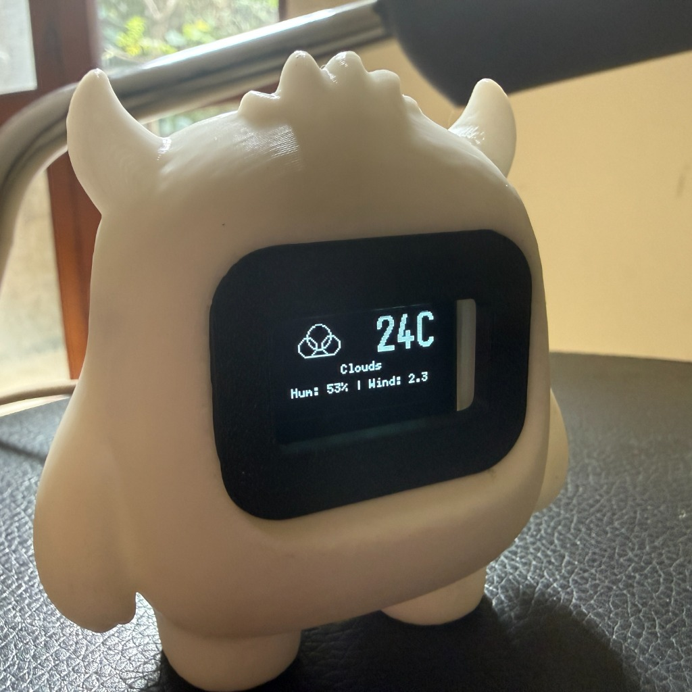
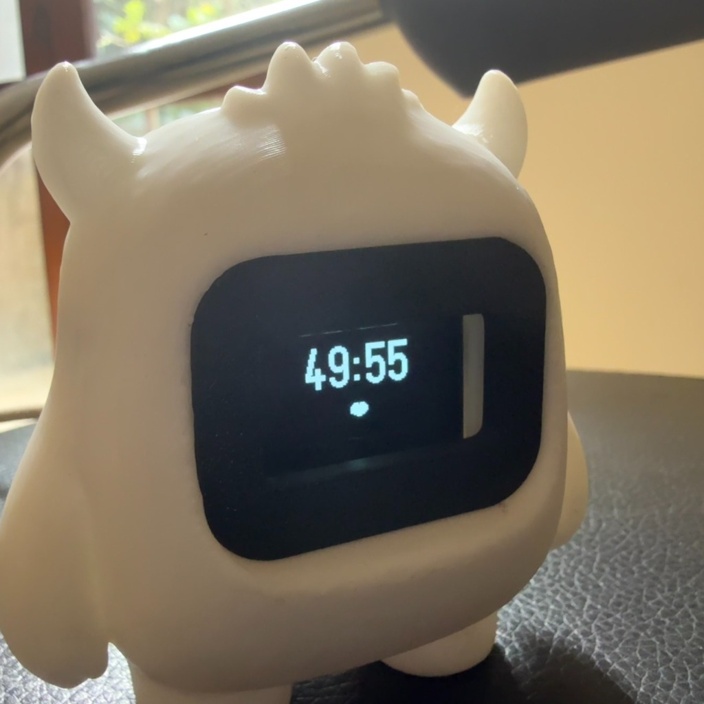
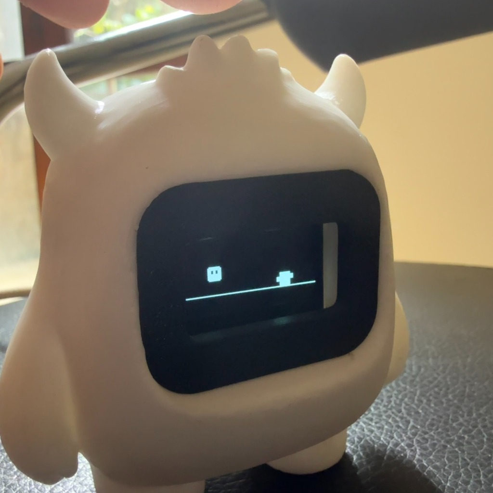

# 🧊 Desk Companion — Yeti Edition

A feature-rich, Wi-Fi connected desk companion built on an ESP32-C3 with an OLED face, capacitive touch, vibration, buzzer, live weather, alarms, a Pomodoro timer, and a mini-game — all packed inside a cute 3D-printed Yeti figurine.

<p align="center">
  
  &nbsp;&nbsp;
  
</p>

---

## ✨ Features at a Glance

<p align="center">
  
  &nbsp;
  
  &nbsp;
  
</p>

---

## 🐾 Living Face & Expressions

The Yeti has a fully animated procedural face rendered on a 128×64 OLED. It reacts dynamically to touch, time of day, and internal state — no fixed sprites, every expression is drawn in code.

**Expressions:**
- 😐 Neutral — resting state with idle animations
- 😊 Happy — large round eyes, subtle bounce
- 😢 Sad — drooping eyes, slow blink
- 😲 Surprised — wide open eyes
- 🤨 Skeptical — one eyebrow raised
- 🥰 Love — heart eyes (triggered by petting)
- 😤 Determined — narrowed focused eyes (Pomodoro mode)
- 😠 Frustrated — angled brows

**Idle Behaviours (auto-triggered):**
- Random blinking, yawning, looking left/right, sneezing
- Happiness decays over time — neglect your Yeti and it gets sad!

---

## 👆 Touch Controls

All interaction happens through a single capacitive touch sensor on top of the Yeti's head.

| Gesture | Action |
|---|---|
| **Single Tap** | Triggers a random happy reaction |
| **Double Tap** | Enter Clock Mode (double tap again to exit) |
| **Triple Tap** | Toggle Pomodoro Focus Mode on/off |
| **Quad Tap (4×)** | Launch the Yeti Run mini-game |
| **Long Press ~1.5s** | Pet mode → Love expression + purring vibration |
| **Long Press in Clock Mode** | Open the Alarm Manager |
| **Extra-Long Press ~3s in Alarm Manager** | Return to Clock |

---

## ⏰ Clock Mode

<p align="center">
  
</p>

Double-tap to enter. The screen has **three sub-views** — cycle between them with a single tap:

### 🕐 Clock View (default)
Displays the current time. Three selectable themes:
- **Big Bold** — large digital numbers, clean and minimal
- **Retro Digital** — blocky font inside a double-frame pixel border
- **Flip Clock** — split-panel mechanical flip-clock style with inverted digit tiles

### 🌤️ Weather Dashboard
Full-screen live weather fetched from [OpenWeatherMap](https://openweathermap.org/) every 15 minutes via a background FreeRTOS task (never blocks the Yeti's face):
- Large pixel-art condition icon: ☀️ Sunny · ☁️ Cloudy · 🌧️ Rain · ❄️ Snow · ⛈️ Thunderstorm
- Current temperature (Celsius or Fahrenheit)
- Condition description, Humidity %, Wind speed

### 🔔 Alarm Manager
Long-press to enter. Manage up to 3 alarms directly on the Yeti — no phone needed:
- **Single Tap** — scroll through Alarm 1 → 2 → 3
- **Double Tap** — toggle the selected alarm ON/OFF (saved instantly to flash memory)
- **Extra-long press** — return to Clock

---

## 🍅 Pomodoro Focus Timer

<p align="center">
  
</p>

Triple-tap to start or stop a focus session. The Yeti enters a determined expression and tracks your time. A custom melody + vibration alerts you when the session ends and break begins.

**Configurable Durations (set from dashboard):**
| Mode | Work | Break |
|---|---|---|
| Short | 25 min | 5 min |
| Long | 50 min | 10 min |
| Deep Work | 90 min | 30 min |

**Pomodoro Themes:**
- **Cute Timer** — giant countdown with a pulsing animated heart
- **Determined Yeti** — Yeti focused expression with time shown above
- **Hourglass** — animated pixel hourglass that drains in real time

---

## 🎮 Yeti Run (Mini-Game)

<p align="center">
  
</p>

Quad-tap (4×) to launch. A Dino-style endless runner with two obstacle types:
- **Cacti / ground obstacles** — tap to jump over them
- **Low birds** — tap to jump over them
- **High birds** — fly overhead safely; jumping into them ends the game

Vibration motor rumbles on collision. Score counts every frame survived. Long-press to quit.

---

## 🌐 Web Dashboard

Connect to the Yeti's IP address (shown on the OLED at startup) in any browser to configure all settings without reflashing.

**Timer & Clock**
- Pomodoro duration (25/5, 50/10, 90/30)
- Pomodoro display theme
- Clock display theme

**Weather**
- City name (any OpenWeatherMap city)
- Units (Celsius / Fahrenheit)
- Weather display theme (Minimal Text or Graphic Icon)

**Alarms**
- Up to 3 independent alarms with time pickers and enable/disable toggles
- Custom alarm message (up to 15 characters, displayed on the OLED)
- Alarm sound: Standard Beep · Gentle Chime · Loud Siren
- Option to hide alarm info in Clock Mode for a clean look

All settings are saved to NVS flash and survive reboots.

---

## 😴 Sleep Mode

After 10 minutes of inactivity the Yeti dims the display and enters a low-power idle. Any touch immediately wakes it up.

---

## 🔧 Hardware

| Component | Detail | Pin |
|---|---|---|
| MCU | ESP32-C3 (160MHz, 4MB flash) | — |
| Display | SSD1306 OLED 128×64 I2C | SDA: GPIO6 · SCL: GPIO7 |
| Touch | Capacitive touch sensor | GPIO2 |
| Vibration | Coin vibration motor | GPIO10 |
| Buzzer | Passive piezo buzzer | GPIO3 |

**Enclosure:** Custom 3D-printed Yeti figurine

---

## 🚀 Setup

### 1. Install dependencies
- [arduino-cli](https://arduino.github.io/arduino-cli/) or Arduino IDE 2.x
- Board: `esp32:esp32` v3.x
- Libraries: `U8g2`, `ArduinoJson`

### 2. Configure credentials
Copy `secrets.h.example` to `secrets.h` and fill in your details:
```cpp
#define WIFI_SSID     "Your_WiFi_SSID"
#define WIFI_PASSWORD "Your_WiFi_Password"
#define OWM_API_KEY   "Your_OpenWeatherMap_API_Key"
```
> `secrets.h` is gitignored and will never be committed.

### 3. Flash
```bash
arduino-cli compile --fqbn esp32:esp32:esp32c3:CDCOnBoot=cdc desk_companion.ino
arduino-cli upload -p /dev/cu.usbmodem101 --fqbn esp32:esp32:esp32c3:CDCOnBoot=cdc desk_companion.ino
```

### 4. Connect
The Yeti displays its IP address on boot. Open it in a browser to configure alarms, weather city, and themes.

---

## 📁 Project Structure

```
desk_companion/
├── desk_companion.ino    # Main firmware — single-file Arduino sketch
├── secrets.h             # Your private credentials (gitignored)
├── secrets.h.example     # Template — copy this to secrets.h
├── images/               # README photos
│   ├── face.jpg
│   ├── pet.jpg
│   ├── weather.jpg
│   ├── pomodoro.jpg
│   └── game.jpg
├── companion/
│   └── music_monitor.py  # Optional: detects system audio and sends status over serial
└── README.md
```

---

## 🔒 Security Note

Credentials (Wi-Fi, API key) are kept in a local `secrets.h` file that is listed in `.gitignore` and never pushed to GitHub. See `secrets.h.example` for the required format.
